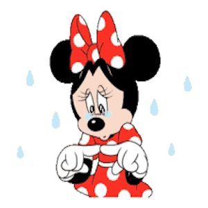

# Trivia Game
Assignment_Trivia Game

# Link to deployed site
https://lalatw.github.io/TriviaGame/


# Images


# Technology used
* html
* css
* javascript
* jQuery


# Code snippets


```

    function checkAnswer(answer) {
        clearInterval(intervalID);
        console.log (answer);
        if (answer === myData[currentQuestion].correctAnswer) {
            $("#message").text("You are correct!");
            $(".form").empty();
            $("#myimage").append('');
            setTimeout (resetQuestion , 5000);
            correctCount ++;
        }

        else {
            $("#message").text("Nope! The correct answer is :  " + myData[currentQuestion].correctAnswer);
            $(".form").empty();
            $("#myimage").append('');
            setTimeout (resetQuestion , 5000);
            incorrectCount ++;
        }

    }
    


```


# Learning points
* Use javascript along with jQuery to add or change the desired behavior of web page.
* Use jQuery click event to triger game start.
* Apply setInterval and setTimeout method to countdown or pause the game.
* Apply variables to store data values.
* Apply "if, else" to specify conditional statements.


# Author 
[Shuhan Laura Lee](https://lalatw.github.io/TriviaGame/)

* Portfolio : https://lalatw.github.io/Responsive-Portfolio/portfolio.html


# License
Standard MIT License
